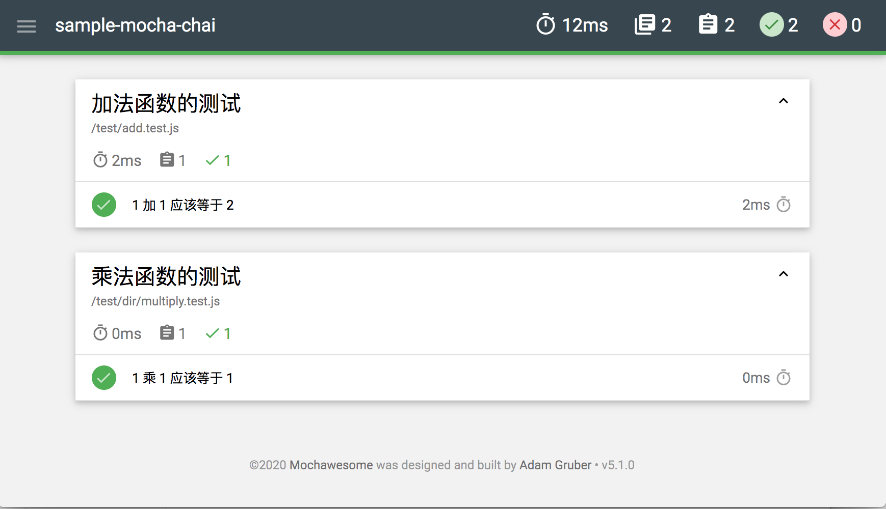
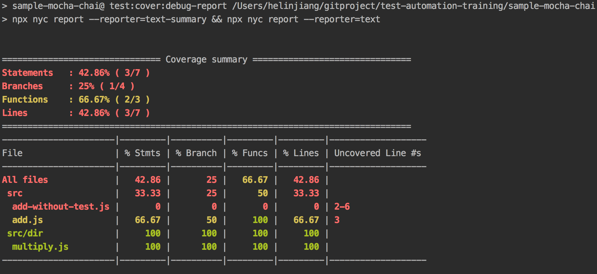
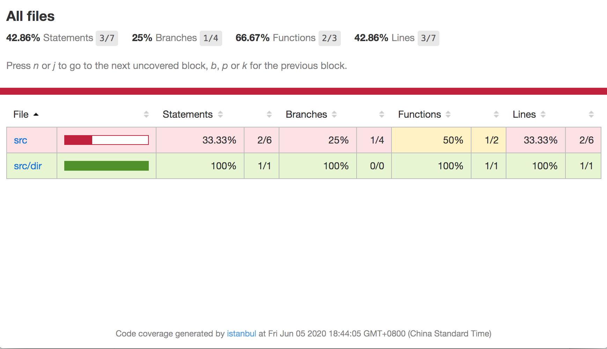

# sample-mocha-chai

本项目提供了基于使用 [Mocha](https://mochajs.org/) + [Chai](https://www.chaijs.com/) 做单元测试的简单范例。

注意，这是一个完整的范例（包含了一些最佳实践），因此你可以参考本项目，快速为自己的项目接入单元测试，并在此之前基础上做扩展。范例包含了：

- 使用 [babel](https://babeljs.io/) 处理 ES6 语法
- 使用 [nyc](https://www.npmjs.com/package/nyc) 统计代码覆盖率，并将结果输出到 `test_output/coverage` 目录下
- 使用 [mochawesome](https://www.npmjs.com/package/mochawesome) 做测试报告，并将结果输出到 `test_output/mochawesome` 目录下
- 使用 [eslint](https://eslint.org/) ，参考了 [vue](https://github.com/vuejs/vue) 的配置


## 1. 安装

```bash
$ npm install
```

## 2. 示例说明

运行单元测试：

```bash
$ npm test
```

成功运行完成之后，在 `test_output` 文件夹下，即可以看到测试报告和覆盖率报告产物。

### 2.1 单元测试报告

注意，项目中我们增加了 `.mocharc.yml` 文件 ，mocha 配置文件说明：https://mochajs.org/#configuring-mocha-nodejs 。

```yaml
require: '@babel/register'
reporter: 'mochawesome'
reporterOptions:
  - 'reportDir=test_output/mochawesome'
recursive: true
```

由于我们使用了 [mochawesome](https://www.npmjs.com/package/mochawesome) 来做报告输出，运行结束之后，可以打开 `test_output/mochawesome/mochawesome.html` ，可以很方便看到自动化测试的结果。




### 2.2 覆盖率报告

注意，项目中我们增加了 `.nycrc.yml` 文件，nyc 配置文件说明：https://www.npmjs.com/package/nyc#common-configuration-options 。

```yaml
all: true
include:
  - "src/**/*.js"
exclude:
  - "**/*.test.js"
reporter: "html"
report-dir: "test_output/coverage"
```

覆盖率报告支持的输出类型可以参考：https://istanbul.js.org/docs/advanced/alternative-reporters/ 。

在本项目中，对于 `add-without-test.js` 我们没有任何测试用例，因此其行覆盖率等数据都是 `0`。

而对于 `add.js` ，由于我们故意有一个分支情况没有补充用例，所以最终的行覆盖率只有 `66.67%`。




你还可以打开 `test_output/coverage/index.html` ，可以很方便看到测试覆盖率的结果。

